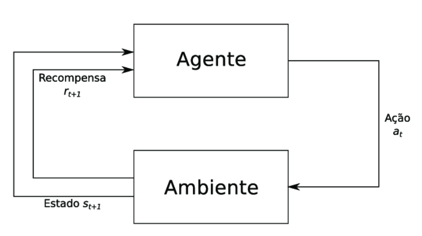

# O que é aprendizado por reforço?

Durante o treinamento do segundo PS do CIS, estudamos várias formas técnicas de aprendizado supervisionado e não supervisionado. O que difere cada uma delas?

**Aprendizado Supervisionado** é a técnica na qual o modelo recebe os dados de entrada e quais os parâmetros esperados de sua saída
**Aprendizado Não Supervisionado** tecninca na qual o modelo recebe apenas a sua entrada e descobre qual a saída

A **aprendizagem por reforço** ganhou notoriedade pelo resultado impressionante obtido pelo [Alpha Go](https://www.youtube.com/watch?v=WXuK6gekU1Y), aplicação da Google. 

As decisões tomadas por uma aplicação baseada em aprendizagem por reforço tem como princípio aumentar a recompensa gerada pelo ambiente. O agente gera uma ação que causa uma mudança no ambiente e o ambiente gera uma recompensa.

Baseado em processos de decisão de Markov, um experimento de aprendizado por reforço exige o conhecimento de alguns conceitos chave.

## Conceitos chave:

Para entender bem o que é aprendizado por reforço, alguns conceitos são necessários:
- Agente
  - O computador
  - Aquele que executa uma ação em um ambiente
  - Recebe uma recompensa ou penalidade por cada ação ou conjunto de ações
- Ambiente
  - O "lugar" onde meu agente está
  - Problema a ser solucionado
- Recompensa
  - Definida pelo cientista
  - Um número que pode ser uma recompensa ou uma penalidade
  - Muda de acordo com o estado do ambiente após a ação do agente
- Recompensa Cumulativa
  - A ideia do agente é maximizar sua recompensa no longo prazo. 
  - Dados históricos
    - Q-Table
  - A maximização leva em conta o conjunto de ações que definem o estado do ambiente no momento em que a recompensa é avaliada
- Estado
  - Parâmetros que definem como o ambiente ou o agente estão em determinado step
  - Em um step, o estado do ambiente é aquilo que define como o ambiente aparenta para o interpretador
  - Em um mesmo step, o estado do agente são as informações da ação que este acabou de tomar e as recompensas que este gerou
- Q-Table
  - Em Q-Learning, a tabela é carregada com todas as informações de estado em um determinado step
    - Cada linha define um step
    - Será indispensável para o cálculo da ação do próximo step
- Aleatoriedade
  - O início de todo experimento é aleatório
  - O cientista de dados só passa as informações de como está o ambiente para o Agente solucionar sozinho

## Onde usar?

Em problemas nos quais os resultados finais não são bem delimitados nem conhecidos pelo cientista.

Em sitações da vida real, o que temos é o aprendizado por reforço. Da mesma forma que o agente ao solucionar um ambiente, recebe uma recompensa, nós, ao solucionarmos problemas da vida real, recebemos recompensas ou penalidades por nossas ações. Um exemplo da vida real e do ambiente virtual no qual o Aprendizado por Reforço pode ser utilizado e é muito bem vindo, são situações de trânsito. **Carros Autônomos** são um bom exemplo de utilização do Reinforcement Learning.

O trânsito é um ambiente caótico por si só. Os parâmetros totais não são bem definidos, o próximo estado é altamente variável e, a cada segundo, uma ação nova é necessária para se manter no ambiente. Um carro autônomo pode ser treinado utilizando do Reinforcement Learning ao receber os dados do ambiente, decidir (com base em suas ações passadas e quais recompensas recebeu) qual a melhor ação para determinado ambiente, receber as recompensas de suas ações (por mais simples que seja, exemplo: Bateu ou não bateu), registrar esses dados em um contexto histórico e começar o ciclo de novo.

Para você que tem CNH, notou alguma semelhança? As etapas são as mesmas do aprendizado humano, por isso o aprendizado por reforço é uma ótima para situações da vida real.

## Como começar?

Os ambientes da biblioteca [gym](https://github.com/openai/gym) são ótimos para começar os testes em RL.

Os algoritmos citados em relação à Q-Table, outros processos de Q e Deep Q Learning não são implementados com bibliotecas, então o cientista deve implementá-los todos por si só. O lado bom é que na internet, assim como em outras áreas da Inteligência Artificial, muita coisa já foi implementada e já está disponível na internet.

Para implementar seu próprio código, não esqueça de ler a documentação disponível em [https://gym.openai.com/docs/](https://gym.openai.com/docs/) e [https://gym.openai.com/envs/CartPole-v0/](https://gym.openai.com/envs/CartPole-v0/)

# Referências

1. [Documentação Gym](https://gym.openai.com/docs/)

1. [Geeks for geeks](https://www.geeksforgeeks.org/what-is-reinforcement-learning/)
2. [O que é Aprendizado por Reforço?](https://www.deeplearningbook.com.br/o-que-e-aprendizagem-por-reforco/)
3. [Reinforcement Learning - Wikipédia](https://en.wikipedia.org/wiki/Reinforcement_learning)
4. [Q-Learning - Wikipédia](https://en.wikipedia.org/wiki/Q-learning)
5. [Markov Decision Process](https://en.wikipedia.org/wiki/Markov_decision_process)

